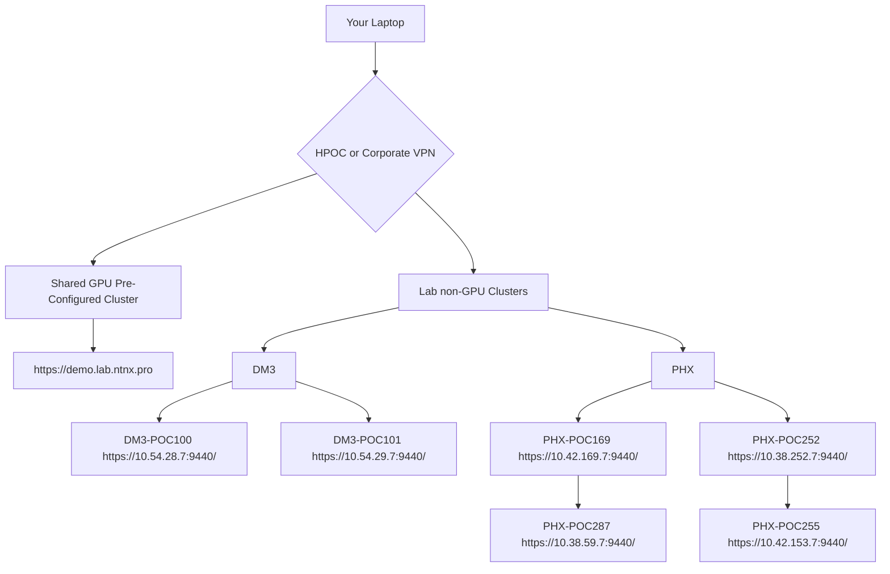

# HPOC Umgebung:

## mit GPU:

### DM3-POC125

Your Reservation Information for DM3-POC125 (NX-3155G-G8).

Cluster IP: https://10.54.76.37:9440/console/#login

Position: A CVM IP: 10.54.76.29 Hypervisor IP: 10.54.76.25 IPMI IP: 10.54.76.33  
Position: A CVM IP: 10.54.76.30 Hypervisor IP: 10.54.76.26 IPMI IP: 10.54.76.34  
Position: A CVM IP: 10.54.76.31 Hypervisor IP: 10.54.76.27 IPMI IP: 10.54.76.35  
Position: A CVM IP: 10.54.76.32 Hypervisor IP: 10.54.76.28 IPMI IP: 10.54.76.36  

***LOGIN CREDENTIALS***

***Prism UI Credentials:*** `admin / nx2TEch123!`  
***CVM Credentials:*** `nutanix / nx2TEch123!`

---

### DM3-POC126

Your Reservation Information for DM3-POC126 (NX-3155G-G8).

Cluster IP: https://10.54.77.37:9440/console/#login

Position: A CVM IP: 10.54.77.29 Hypervisor IP: 10.54.77.25 IPMI IP: 10.54.77.33  
Position: A CVM IP: 10.54.77.30 Hypervisor IP: 10.54.77.26 IPMI IP: 10.54.77.34  
Position: A CVM IP: 10.54.77.31 Hypervisor IP: 10.54.77.27 IPMI IP: 10.54.77.35  
Position: A CVM IP: 10.54.77.32 Hypervisor IP: 10.54.77.28 IPMI IP: 10.54.77.36  

***LOGIN CREDENTIALS***

***Prism UI Credentials:*** `admin / nx2TEch123!`  
***CVM Credentials:*** `nutanix / nx2TEch123!`

## Fileserver:

## IP-Ranges

---
## Ohne GPU

***PHX-POC251*** 

Cluster IP: https://10.38.251.37:9440/console/#login

Position: A CVM IP: 10.38.251.29 Hypervisor IP: 10.38.251.25 IPMI IP: 10.38.251.33  
Position: B CVM IP: 10.38.251.30 Hypervisor IP: 10.38.251.26 IPMI IP: 10.38.251.34  
Position: C CVM IP: 10.38.251.31 Hypervisor IP: 10.38.251.27 IPMI IP: 10.38.251.35  
Position: D CVM IP: 10.38.251.32 Hypervisor IP: 10.38.251.28 IPMI IP: 10.38.251.36  

***LOGIN CREDENTIALS***

***Prism UI Credentials:*** `admin / nx2TEch123!`  
***CVM Credentials:*** `nutanix / nx2TEch123!`

---

***PHX-POC252***

Cluster IP: https://10.38.252.37:9440/console/#login

Position: A CVM IP: 10.38.252.29 Hypervisor IP: 10.38.252.25 IPMI IP: 10.38.252.33  
Position: B CVM IP: 10.38.252.30 Hypervisor IP: 10.38.252.26 IPMI IP: 10.38.252.34  
Position: C CVM IP: 10.38.252.31 Hypervisor IP: 10.38.252.27 IPMI IP: 10.38.252.35  
Position: D CVM IP: 10.38.252.32 Hypervisor IP: 10.38.252.28 IPMI IP: 10.38.252.36  

***LOGIN CREDENTIALS***

***Prism UI Credentials:*** `admin / nx2TEch123!`  
***CVM Credentials:*** `nutanix / nx2TEch123!`

## Fileserver:

## IP-Ranges

